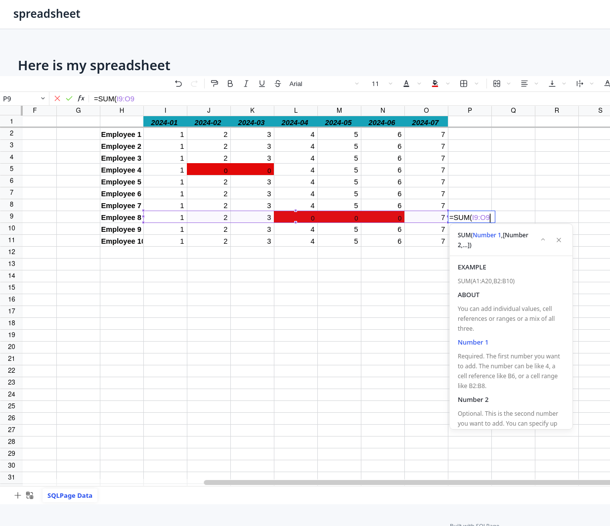

# Spreadsheet component

> [!WARNING]
> **Important legal notice** This component is not distributed under the same permissive MIT license as the rest of SQLpage, but rather under the [GNU AGPL v3 license](./LICENSE).
> This means that you can either:
> - use the component in a project that is itself open source under the AGPL license, for free, or
> - use it in a commercial, closed source, setting by **buying a 600€ yearly license** for the component from us: contact@datapage.app

The spreadsheet component generates an online editable spreadsheet similar to Google Sheets or Excel, the contents of which are loaded from the results of your SQL query.  
It has the ability to edit cell data by posting their contents to another SQLpage.

## Screenshot

## Documentation
### Top-level properties

- **update\_link**:  the name of another sql file, to which cell contents will be posted on update. The sql file will receive the variables:
  - `:x` and `:y` (position of the cell that was updated),
  - `:value` (the new textual contents of the cell), and
  - `:id` if an id was assigned to the cell from the row-level properties.
- **freeze\_x**: the number of columns to freeze on the left side
- **freeze\_y**: the number of rows to freeze on the top side

### Row-Level properties

- **x** the value of the x-axis (horizontal cell number)
- **y** the value of the y-axis (vertical cell number)
- **value** the value of the cell
- **bold** If present, the cell text is bold
- **italic** If present, the cell text is italic
- **color** cell background color. Can be a [SQLPage color name](https://sql.datapage.app/colors.sql) or a hexadecimal color code like `#80cbc4`.
- **center** If present, the cell text is centered
- **right** If present, the cell text is right-aligned
- **number\_format** format the number according to the specified number format. Uses [excel number format codes](https://support.microsoft.com/en-us/office/number-format-codes-5026bbd6-04bc-48cd-bf33-80f18b4eae68).
- **id** If present, the cell has this unique identifier that will be passed to the update\_link sql file.
